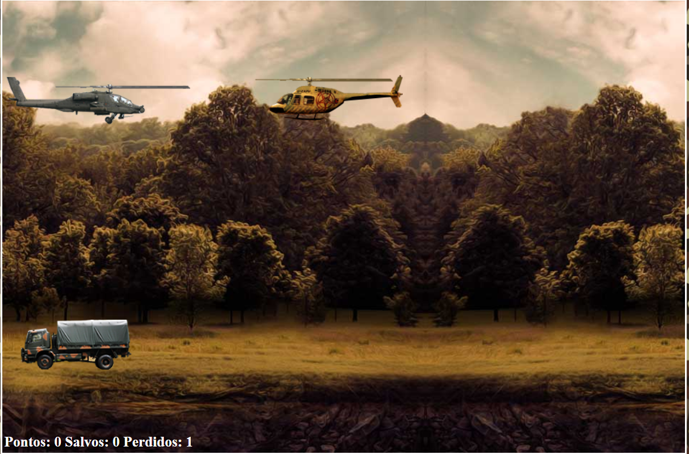

# Jogo Helicóptero 

Esse é o repositório referente ao projeto "Construindo o seu primeiro jogo de naves" do bootcamp do Take Blip Web Developer em parceria com a Digital Innovation One. 

Neste projeto recriamos um jogo de helicóptero em HTML + CSS + Javascript.

Em relação ao projeto original eu modifiquei: 

✅ 1-  Removi o tiro automático do helicóptero que ocorria quando um helicóptero inimigo estava em rota de colisão com o helicóptero que o jogador controla. Agora é necessário apertar a tecla "D" para efetuar um tiro.

✅ 2 - Adicionei um áudio para indicar quando ocorre uma colisão entre o helicóptero que o jogador controla e um helicóptero inimigo. 

🎥 O helicóptero não dispara mais automaticamente:

